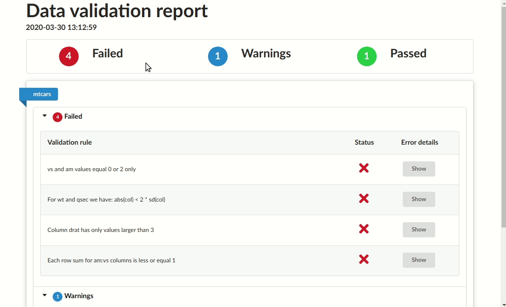
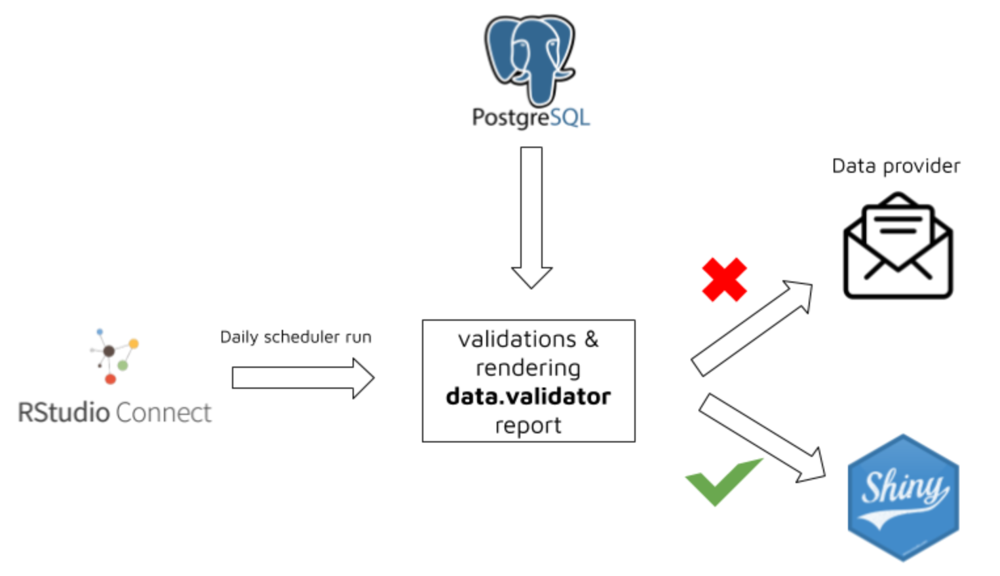

# data.validator <a href="https://appsilon.github.io/data.validator/"></a>

> _Validate your data and create nice reports straight from R._

<!-- badges: start -->
[](https://github.com/Appsilon/data.validator/actions)
[](https://codecov.io/gh/Appsilon/data.validator?branch=main)
[](https://CRAN.R-project.org/package=data.validator)
[](https://CRAN.R-project.org/package=data.validator)
<!-- badges: end -->

## Description

`data.validator` is a package for scalable and reproducible data validation. It provides:

* Functions for validating datasets in `%>%` pipelines: `validate_if`, `validate_cols` and `validate_rows`
* Predicate functions from [assertr](https://github.com/ropensci/assertr) package, like `in_set`, `within_bounds`, etc.
* Functions for creating user-friendly reports that you can send to email, store in logs folder,
  or generate automatically with RStudio Connect.



## Installation

Install from CRAN:

```r
install.packages("data.validator")
```

or the latest development version:

```r
remotes::install_github("Appsilon/data.validator")
```

## Data validation

Validation cycle is simple:

1. Create report object.
2. Prepare your dataset. You can load it, preprocess and then run `validate()` pipeline.
2. Validate your datasets.
    * Start validation block with `validate()` function. It adds new section to the report.
    * Use `validate_*` functions and predicates to validate the data. You can create your custom predicates. See `between()` example.
    * Add assertion results to the report with `add_results()`
3. Print the results or generate HTML report.

```r
library(assertr)
library(magrittr)
library(data.validator)

report <- data_validation_report()

validate(mtcars, name = "Verifying cars dataset") %>%
  validate_if(drat > 0, description = "Column drat has only positive values") %>%
  validate_cols(in_set(c(0, 2)), vs, am, description = "vs and am values equal 0 or 2 only") %>%
  validate_cols(within_n_sds(1), mpg, description = "mpg within 1 sds") %>%
  validate_rows(num_row_NAs, within_bounds(0, 2), vs, am, mpg, description = "not too many NAs in rows") %>%
  validate_rows(maha_dist, within_n_mads(10), everything(), description = "maha dist within 10 mads") %>%
  add_results(report)

between <- function(a, b) {
  function(x) { a <= x && x <= b }
}

validate(iris, name = "Verifying flower dataset") %>%
  validate_if(Sepal.Length > 0, description = "Sepal length is greater than 0") %>%
  validate_cols(between(0, 4), Sepal.Width, description = "Sepal width is between 0 and 4") %>%
  add_results(report)

print(report)
```


## Reporting

Print results to the console:

```r
print(report)

# Validation summary:
#  Number of successful validations: 1
#  Number of failed validations: 4
#  Number of validations with warnings: 1
#
# Advanced view:
#
# |table_name |description                                       |type    | total_violations|
# |:----------|:-------------------------------------------------|:-------|----------------:|
# |mtcars     |Column drat has only positive values              |success |               NA|
# |mtcars     |Column drat has only values larger than 3         |error   |                4|
# |mtcars     |Each row sum for am:vs columns is less or equal 1 |error   |                7|
# |mtcars     |For wt and qsec we have: abs(col) < 2 * sd(col)   |error   |                4|
# |mtcars     |vs and am values equal 0 or 2 only                |error   |               27|
# |mtcars     |vs and am values should equal 3 or 4              |warning |               24|
```


Save as HTML report

```r
save_report(report)
```

## Full examples

### Checking key columns uniqueness

Common step in data validation is assuring that key columns are unique and not empty.

Test dataset for preparing the validation schema can be created with [`fixtuRes`](https://github.com/jakubnowicki/fixtuRes) package.

```r
library(fixtuRes)
library(magrittr)
library(assertr)
library(data.validator)

my_mock_generator <- fixtuRes::MockDataGenerator$new("path-to-my-configuration.yml")
my_data_frame <- my_mock_generator$get_data("my_data_frame", 10)

report <- data.validator::data_validation_report()

validate(my_data_frame, name = "Verifying data uniqueness") %>%
  validate_if(is_uniq(id), description = "ID column is unique") %>%
  validate_if(!is.na(id) & id != "", description = "ID column is not empty") %>%
  validate_if(is.character(code), description = "CODE column is string") %>%
  validate_rows(col_concat, is_uniq, code, type, description = "CODE and TYPE combination is unique") %>%
  add_results(report)

print(report)

# Validation summary:
#  Number of successful validations: 4
#  Number of failed validations: 0
#  Number of validations with warnings: 0
#
# Advanced view:
#
#
# |table_name              |description                         |type    | total_violations|
# |:-----------------------|:-----------------------------------|:-------|----------------:|
# |Verifying data uniqness |CODE and TYPE combination is unique |success |               NA|
# |Verifying data uniqness |CODE column is string               |success |               NA|
# |Verifying data uniqness |ID column is not empty              |success |               NA|
# |Verifying data uniqness |ID column is unique                 |success |               NA|
```

### Custom reporting on leaflet map

- [Custom reporting on leaflet map](https://github.com/Appsilon/data.validator/blob/master/examples/custom_report/example.R)


### Other examples

- [Minimal example to get you started](https://github.com/Appsilon/data.validator/blob/master/examples/minimal_example/example.R)

- [Convenient API](https://github.com/Appsilon/data.validator/blob/master/examples/new_api/example.R)

- [Various way of saving reports](https://github.com/Appsilon/data.validator/blob/master/examples/sample_validations/example.R)

- [Rendering report as a part of Shiny app](https://github.com/Appsilon/data.validator/blob/master/examples/shiny_app/shiny_example.R)

## Using custom report templates

In order to generate rmarkdown report `data.validator` uses predefined report template.
You may find it in `inst/rmarkdown/templates/standard/skeleton/skeleton.Rmd`.

The report contains basic requirements for each report template used by `save_report` function:

- defining params

```
params:
  generate_report_html: !expr function(...) {}
  extra_params: list()
```

- calling content renderer chunk

````
```{r generate_report, echo = FALSE}
params$generate_report_html(params$extra_params)
```
````

If you want to use the template as a base you can use RStudio.
Load the package and use `File -> New File -> R Markdown -> From template -> Simple structure for HTML report summary`.
Then modify the template adding custom title, or graphics with leaving the below points unchanged and specify the path inside `save_report`'s `template` parameter.

# How the package can be used in production?

The package was successfully used by Appsilon in production environment for protecting Shiny Apps against being run on incorrect data.

The workflow was based on the below steps:

1. Running [RStudio Connect Scheduler](https://rstudio.com/products/connect/) daily.

2. Scheduler sources the data from PostgreSQL table and validates it based on predefined rules.

3. Based on validation results a new `data.validator` report is created.

4a. When data is violated:

- data provider and person responsible for data quality receives report via email

- thanks to `assertr` functionality, the report is easily understandable both for technical, and non-technical person

- data provider makes required data fixes

4b. When data is correct:

- a specific trigger is sent in order to reload Shiny data

### Working example

Check the simple example of scheduled validation and storing data as `pin` here: [connect_validation_workflow](https://connect.prod.aws.appsilon.com/connect_validation_workflow/)

The workflow is presented on below graphics


## How to contribute?

If you want to contribute to this project please submit a regular PR, once you're done with new feature or bug fix.

Reporting a bug is also helpful - please use [GitHub issues](https://github.com/Appsilon/data.validator/issues) and describe your problem as detailed as possible.

## Appsilon


Appsilon is a **Posit (formerly RStudio) Full Service Certified Partner**.<br/>
Learn more at [appsilon.com](https://appsilon.com).

Get in touch [opensource@appsilon.com](mailto:opensource@appsilon.com)

Explore the [Rhinoverse](https://rhinoverse.dev) - a family of R packages built around [Rhino](https://appsilon.github.io/rhino/)!

<a href = "https://appsilon.com/careers/" target="_blank"></a>
