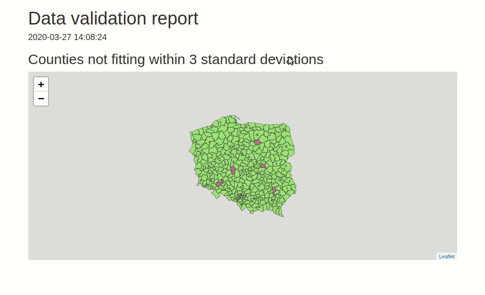

[](https://codecov.io/gh/Appsilon/data.validator?branch=master)


data.validator
==============

# Description

`data.validator` is a package for scalable and reproducible data validation. It provides:

* Functions for validating datasets in `%>%` pipelines: `assert_if`, `assert_cols` and `assert_rows`
* Predicate functions from [assertr](https://github.com/ropensci/assertr) package, like `in_set`, `within_bounds`, etc.
* Functions for creating user-friendly reports that you can send to email, store in logs folder, 
  or generate automatically with RStudio Connect.


# Installation

For now we use Appsilon `assertr` fork, with custom functionalities we needed for `data.validator`. 
This dependency will be merged with `data.validator` soon.

```
devtools::install_github("Appsilon/assertr")
devtools::install_github("Appsilon/data.validator")
```


## Data validation

Validaton cycle is simple:

1. Create report object.
2. Prepare your dataset. You can load it, preprocess and then run `validate()` pipeline.
2. Validate your datasets.
    * Start validation block with `validate()` function. It adds new section to the report.
    * Use `assert_*` functions and predicates to validate the data. You can create your custom predicates. See `between()` example.
    * Add assertion results to the report with `add_results()`
3. Print the results or generate HTML report.

TODO: list and examples of available predicate functions needed.

```
library(assertr)
library(data.validator)

report <- data_validation_report()

validate(mtcars, name = "Verifying cars dataset") %>%
  assert_if(drat < 0, description = "Column drat has only positive values") %>%
  assert_cols(in_set(c(0, 2)), vs, am, description = "vs and am values equal 0 or 2 only") %>%
  assert_cols(within_n_sds(1), mpg, predicate_calculated_from_column = T, description = "mpg within 1 sds") %>%
  assert_rows(num_row_NAs, within_bounds(0, 2), vs, am, mpg, description = "not too many NAs in rows") %>%
  assert_rows(maha_dist, within_n_mads(10), everything(), predicate_calculated_from_reduced_row = T, description = "maha dist within 10 mads") %>%
  add_results(report)

between <- function(a, b) {
  function(x) { a <= x && x <= b }
}

validate(iris, name = "Verifying flower dataset") %>%
  assert_if(Sepal.Length > 0, description = "Sepal length is greater than 0") %>%
  assert_cols(between(0, 4), Sepal.Width, description = "Sepal width is between 0 and 4") %>%
  add_results(report)

print(report)
```


# Reporting

Print results to the console:

```
print(report)

# Validation summary: 
#  Number of successful validations: 1
#  Number of failed validations: 4
#  Number of validations with warnings: 1
#
# Advanced view: 
#  
# |table_name |description                                       |type    | total_violations|
# |:----------|:-------------------------------------------------|:-------|----------------:|
# |mtcars     |Column drat has only positive values              |success |               NA|
# |mtcars     |Column drat has only values larger than 3         |error   |                4|
# |mtcars     |Each row sum for am:vs columns is less or equal 1 |error   |                7|
# |mtcars     |For wt and qsec we have: abs(col) < 2 * sd(col)   |error   |                4|
# |mtcars     |vs and am values equal 0 or 2 only                |error   |               27|
# |mtcars     |vs and am values should equal 3 or 4              |warning |               24|
```


Save as HTML report

```
save_report(report)
```


## Creating custom reports // TODO: this section needs to be updated

Define function of `validation_results` parameter that returns HTML object or HTML widget.
The `validation_results` parameter is assumed to be passed as a results table extracted with `get_results(validator)`.

*Note* The function can also store optional parameters that should be passed to `save_report` function while generating a new report.

In this example we create custom report that shows validation results of checking wheter population across Polish counties fits within 3 standard deviations. The results are shown on leaflet map.

```
library(data.validator)
library(magrittr)
library(assertr)

validator <- create_validator()

population <- read.csv("population.csv", colClasses = c("character", "character", "character", "integer", "integer", "integer"))
population %>%
  insist(within_n_sds(3), total, success_fun = success_append, error_fun = error_append) %>%
  add_results(validator)

print(validator)

# Validation summary: 
#  Number of successful validations: 0
#  Number of failed validations: 1
#  Number of validations with warnings: 0
#
# Advanced view: 
# 
# |table_name |description |type  | total_violations|
# |:----------|:-----------|:-----|----------------:|
# |population |NA          |error |                6|

render_leaflet_report <- function(validation_results, population_data, correct_col, violated_col) {
  states <- rgdal::readOGR("counties.shp", GDAL1_integer64_policy = TRUE, verbose = FALSE)
  population <- population_data
  violated <- validation_results %>%
    tidyr::unnest(error_df, keep_empty = TRUE) %>%
    dplyr::pull(index)
  states@data <- dplyr::left_join(states@data, population, by = c("JPT_KOD_JE" = "county_ID"))
  states@data$color <- correct_col
  states@data$color[violated] <- violated_col
  htmltools::tagList(
    htmltools::h2("Counties not fitting within 3 standard deviations"),
    leaflet::leaflet(states) %>%
      leaflet::addPolygons(color = "#444444", weight = 1, smoothFactor = 0.5,
                  opacity = 0.5, fillOpacity = 0.5,
                  fillColor = states@data$color,
                  label = glue::glue("County: {states@data$county} <br> Population: {states@data$total}") %>% lapply(htmltools::HTML),
                  highlightOptions = leaflet::highlightOptions(color = "white", weight = 2,
                                                      bringToFront = TRUE))
  )
}

save_report(
  validator, ui_constructor = render_leaflet_report,
  population_data = population, correct_col = "#52cf0a", violated_col = "#bf0b4d"
)
```

The resulting report


# Using custom report templates

In order to generate rmarkdown report `data.validator` uses predefined report template.
You may find it [here](inst/rmarkdown/templates/standard/skeleton/skeleton.Rmd).

The report contains basic requirements for each report template used by `save_report` function:

- defining params

```
params:
  generate_report_html: !expr function(...) {}
  extra_params: list()
```

- calling content renderer chunk

````
```{r generate_report, echo = FALSE}
params$generate_report_html(params$extra_params)
```
````

If you want to use the template as a base you can use RStudio.
Load the package and use `File -> New File -> R Markdown -> From template -> Simple structure for HTML report summary`.
Then modify the template adding custom title, or graphics with leaving the below points unchanged and specify the path inside `save_report`'s `template` parameter.

# How the package can be used in production?

The package was successfuly used by Appsilon in production enviroment for protecting Shiny Apps against beeing run on incorrect data.

The workflow was based on the below steps:
1. Running [RStudio Connect Scheduler](https://rstudio.com/products/connect/) daily.
2. Scheduler sources the data from PostgreSQL table and validates it based on predefined rules.
3. Based on validation results a new `data.validator` report is created.  
4a. When data is violated:
- data provider and person responsible for data quality receives report via email
- thanks to `assertr` functionality, the report is easily understandable both for technical, and non-technical person
- data provider makes required data fixes  
4b. When data is correct:
- a specific trigger is sent in order to reload Shiny data 

The workflow is presented on below graphics


# More examples

For more options check package documentation or [examples](examples).
