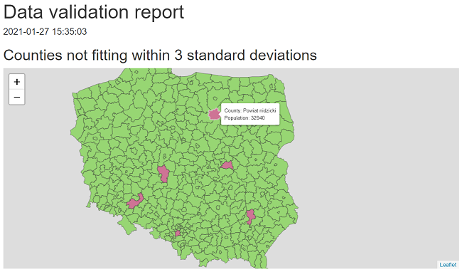

```{r, include = FALSE}
knitr::opts_chunk$set(
  collapse = TRUE,
  comment = "#>"
)
```

### Introduction

`data.validator` is a set of tools for creating reports based on validation 
results from [`assertr`](https://github.com/ropensci/assertr).

It provides tools for creating user-friendly reports that you can send by email,
store in a logs folder, or generate automatically with RStudio Connect.

### Validate data with `assertr`

This is a basic example of how to validate data with `assertr`:

```{r, eval=FALSE}
library(assertr)
library(dplyr)

validate(mtcars) %>%
  assert_cols(description = "vs and am values equal 0 or 2 only", 
         in_set(c(0, 2)), vs, am) %>%
  assert_cols(description = "vs and am values should equal 3 or 4", 
         skip_chain_opts = TRUE,
         error_fun = warning_append, in_set(c(3, 4)), gear, carb) %>%
  assert_rows(description = "Each row sum for am:vs columns is less or equal 1",
              rowSums, within_bounds(0, 1), vs:am) %>%
  assert_cols(description = "For wt and qsec we have: abs(col) < 2 * sd(col)",
         within_n_sds(2), wt, qsec) %>%
  assert_if(description = "Column drat has only positive values", 
         drat > 0) %>%
  assert_if(description = "Column drat has only values larger than 3", 
         drat > 3) %>%
  add_results(report)
```

See the [`assertr` vignette](https://docs.ropensci.org/assertr/) for the full specification.

### Present results with `data.validator`

The first step is to create a validator.

```{r}
library(data.validator)
report <- data_validation_report()
```

Next we have to add validation results to the validator.

```{r, message=FALSE}
library(assertr)
library(dplyr)

validate(mtcars) %>%
  assert_cols(description = "vs and am values equal 0 or 2 only", 
         in_set(c(0, 2)), vs, am) %>%
  assert_cols(description = "vs and am values should equal 3 or 4", 
         skip_chain_opts = TRUE, error_fun = warning_append, 
         in_set(c(3, 4)), gear, carb) %>%
  assert_rows(description = "Each row sum for am:vs columns is less or equal 1",
              rowSums, within_bounds(0, 1), vs:am) %>%
  assert_cols(description = "For wt and qsec we have: abs(col) < 2 * sd(col)",
         within_n_sds(2), wt, qsec) %>%
  assert_if(description = "Column drat has only positive values", 
         drat > 0) %>%
  assert_if(description = "Column drat has only values larger than 3", 
         drat > 3) %>%
  add_results(report)
```

Finally, we use one of the available methods to present the results.

Either print the summary,

```{r}
print(report)
```

or save it as an HTML report.

```{r, eval=FALSE}
save_report(report)
```

### Creating custom reports

Define a function that has a `validation_results` parameter and returns an HTML 
object or HTML widget. The `validation_results` parameter is assumed to be 
passed as a results table extracted with `get_results(validator)`.

*Note* The function can also store optional parameters that should be passed to 
the `save_report` function while generating a new report.

In this example we create a custom report that shows validation results of 
checking whether population across Polish counties fits within 3 standard 
deviations. 

```{r}
library(data.validator)
library(magrittr)
library(assertr)

report <- data_validation_report()

file <- system.file("extdata", "population.csv", package = "data.validator")
population <- read.csv(file, colClasses = c("character", "character", "character",
                                            "integer", "integer", "integer"))

validate(population) %>%
  assert_if(within_n_sds(3), total) %>%
  add_results(report)

print(report)
```

We can also present the results on a Leaflet map.

```{r, eval=FALSE}
render_leaflet_report <- function(validation_results, population_data, correct_col, violated_col) {
  file <- system.file("extdata", "counties.json", package = "data.validator")
  states <- rgdal::readOGR(file, GDAL1_integer64_policy = TRUE, verbose = FALSE)

  violated <- validation_results %>%
    tidyr::unnest(error_df, keep_empty = TRUE) %>%
    dplyr::pull(index)

  states@data <- dplyr::left_join(states@data, population_data,
                                  by = c("JPT_KOD_JE" = "county_ID"))
  states@data$color <- correct_col
  states@data$color[violated] <- violated_col
  states@data$label <- glue::glue("County: {states@data$county} <br>",
                                  "Population: {states@data$total}")

  htmltools::tagList(
    htmltools::h2("Counties not fitting within 3 standard deviations"),
    leaflet::leaflet(states) %>%
      leaflet::addPolygons(color = "#444444", weight = 1, smoothFactor = 0.5,
                           opacity = 0.5, fillOpacity = 0.5,
                           fillColor = states@data$color,
                           label = states@data$label %>% lapply(htmltools::HTML),
                           highlightOptions = leaflet::highlightOptions(color = "white",
                                                                        weight = 2,
                                                                        bringToFront = TRUE))
  )
}

save_report(
  report,
  ui_constructor = render_leaflet_report,
  population_data = population,
  correct_col = "#52cf0a",
  violated_col = "#bf0b4d"
)
```



### Creating custom report templates

In order to generate R Markdown reports `data.validator` uses a predefined report template like the one below.

<pre><code>&#45;&#45;&#45;
title: Data validation report
output: html_document
params:
  generate_report_html: !expr function(...) &#123;&#125;
  extra_params: !expr list()
&#45;&#45;&#45;

&#35;&#35;&#35;&#35; &#96;r format(Sys.time(), "%Y-%m-%d %H:%M:%S")&#96;

&#96;&#96;&#96;{r generate_report, echo = FALSE}
params&#36;generate_report_html(params&#36;extra_params)
&#96;&#96;&#96;</code></pre>

You can use the default template as a basis for creating your own template. In order to do this, first load the package in RStudio. Then select _File_ &#8594; _New File_ &#8594; _R Markdown_ &#8594; _From Template_ &#8594; _Simple structure for HTML report summary_.

Next modify the template by adding for example a custom title or graphics. Leave the `params` section in the header unchanged, as well as the `generate_report` content renderer chunk.

When calling the `save_report` function, make sure that to specify the path to the custom template in the `template` parameter.

### Using the package in production

The package is successfully used by Appsilon in a production environment for protecting Shiny apps against being run on incorrect data.

The workflow is based on the steps below:

1. Running [RStudio Connect Scheduler](https://rstudio.com/products/connect/) daily.

2. The scheduler sources the data from a PostgreSQL table and validates it based on predefined rules.

3. Based on validation results a new `data.validator` report is created.  

4.

  a. When data validation rules are violated:

    - The data provider and the person responsible for data quality receive a report via email. Thanks to `assertr` functionality, the report is easily understandable for both technical and non-technical persons.

    - The data provider makes the required data fixes.  


  b. When the data meets all validation rules:

    - A specific trigger is sent in order to reload the data in the Shiny app. 

### More examples

For more options check the package documentation or [examples](https://github.com/Appsilon/data.validator/tree/master/examples).

